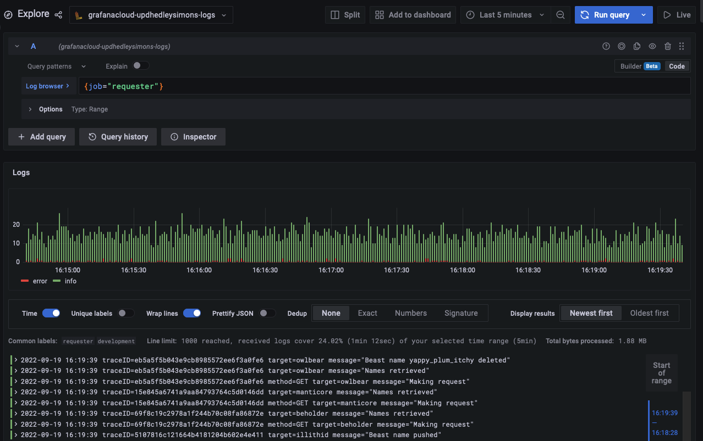
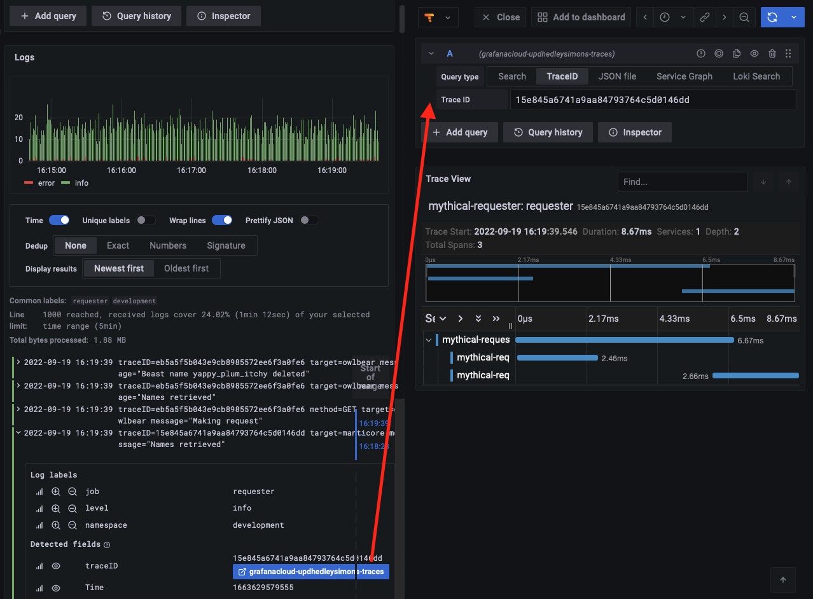
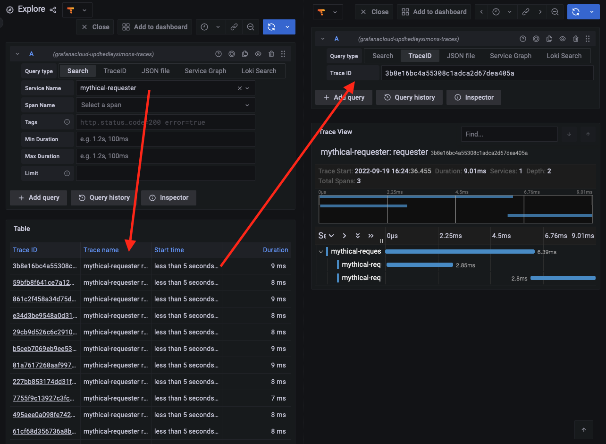
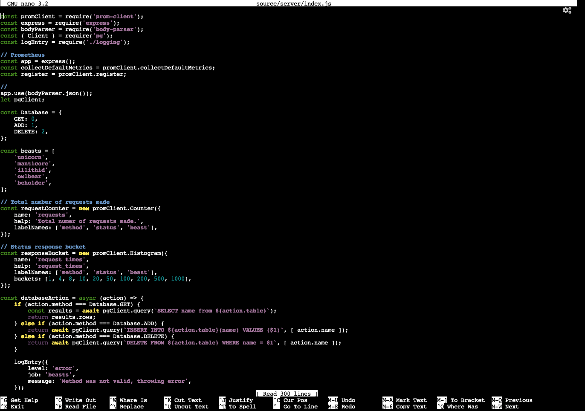
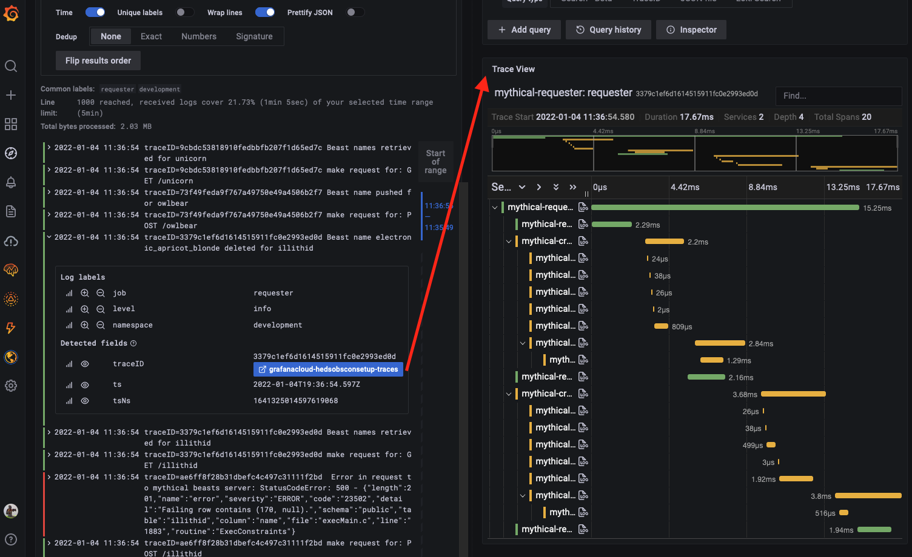
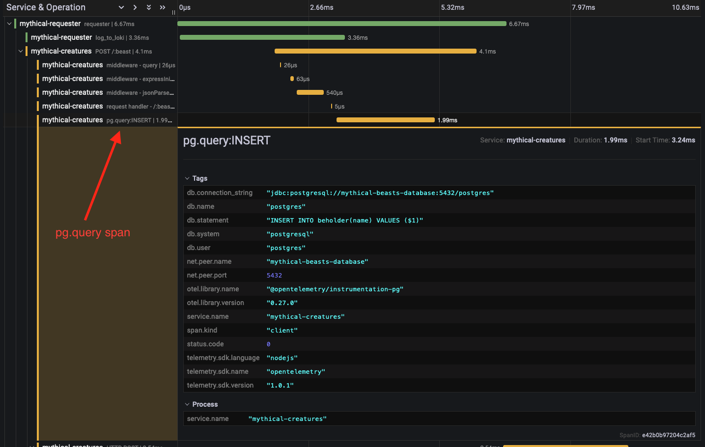

# Breakout 2 - Instrumenting Code for Traces

## Pre-requisites

* Linux shell knowledge
* vim or Nano/Pico editor knowledge
* Access to the WebShell via the link you received in your workshop email
  * Note: Username and password should have been pre-supplied

This workshop includes the editing of files in the WebTerminal you have been given login details for. Both vim and pico have been included in the webterminal to allow you to carry out this editing. All of the examples in this breakout use `pico`, as it’s a simple to use editor, but feel free to use `vim` if you’re familiar with it.

The Pico editor can be navigated using your keyboard cursor keys (as well as Page-Up and Page-Down to move pages), as well as some specific `Ctrl` key based shortcuts:

* Paste: **Ctrl-V**
* Save file: **Ctrl-O**
* Quit: **Ctrl-X**
* Cancel: **Ctrl-C**

## Breakout

In this breakout, you’re going to instrument a small piece of JavaScript code to send traces to Grafana Cloud and then examine those traces.

---
<span style="color:red">
Important Note:
</span>
This breakout relies on the correct modification of code. As with everything in life, nothing is guaranteed, and because of this there are finished copies of these files within your home directory in the web shell. Should you fail to see traces and logs in Grafana after making the code changes, run the following to rebuild the application with working code and deploy it:

```bash
./golden-source-build.sh
```
---

1. Start by logging into the webterminal with your username and password. This will log you into a home directory in a Debian Linux shell where we’ll edit some files and deploy an application to a k8s cluster.

Your home directory includes a few things:

* Manifests for deploying both applications and a Grafana Agent instance to a k8s cluster, as well as shell scripts to automate this for you.
* Source code for a small application that consists of a HTTP server that talks to a Postgres Database, as well as a service that makes HTTP GET/POST/DELETE requests to the HTTP server.

As mentioned in the workshop presentation, there are a couple of ways to instrument your source code to start receiving traces from them. The first is that of manually instrumenting code, where a developer decides what they want to trace, and which code to create spans for.

We’re going to first modify the requesting service so we can get some traces out of it, and see them in Grafana Cloud.

2. Run:
```bash
pico source/requester/index.js
```

in the shell.

In this source file you’ll see some code that:

* Requires some utility libraries (the first three lines) including a logging library that sends messages to Grafana Cloud Logging via the Grafana Agent.
* Defines the names of some mythical beasts.
* Defines a `makeRequest` function that makes requests to the downstream HTTP server.

This `makeRequest` function is called on a set of timers that reset themselves when it completes. We’re going to add tracing to this function.

3. At the top of the source file, add:

```javascript
const tracingUtils = require('./tracing')();
const { api, tracer, propagator } = tracingUtils;
```

To import the tracing libraries and then assign the objects we need to use tracing to some local variables. The `tracing` file is a small utility file that we’ve written that includes all of the OpenTelemetry libraries that are required, and exposes some objects we can use to add traces and spans.

4. Move to the `makeRequest` function definition. You can see some variables declared at the start of this function. We’re going to create a new span after these variable definitions which will include all of the code in the function.

After the `let error = false;` line, add a newline with ‘Enter’, and then add:
```javascript
    // Create a new span
    const requestSpan = tracer.startSpan("requester");
    requestSpan.setAttribute('creature.type', beast);
    const { traceId } = requestSpan.spanContext();
```

This will do a few things, in order of line:

* Create a new span. As this is the first span we’ve declared, it’ll be the first span in a new trace.
* Sets a new tag attribute on the span, the `creature.type` tag, whose value will be the current value of the `beast` variable.
* Retrieve the trace ID of the span (the trace the span belongs to). As this is a new trace, a new trace ID will have been created.

5. Now that we have a new span, we need to create a context for it. The context will wrap the entirety of the rest of the function. Below the code you’ve just added, add the following:

```javascript
    // Create a new context for this request
    api.context.with(api.trace.setSpan(api.context.active(), requestSpan), async () => {
```

This line creates a new trace context, and uses the span we just created to wrap the rest of the function.

6. Under the lines you just added, copy and paste the following line:

```javascript
        // Add the headers required for trace propagation
        headers = propagator(requestSpan);
```

Remember that in the presentation, we said that to ensure that the trace can continue between services, we need to propagate the trace information to any downstream service. As we’ll want to continue the trace in the server, we use the propagation function defined in the tracing utilities to do this. The `propagator` function adds a new HTTP header to the headers we’ll send,  containing the trace information which the OpenTelemetry tracing collector in the downstream service will unpack to continue spans in the same trace.

7. Now use the cursor down arrow or page down on your keyboard until you see the following (it is close to the bottom of the source file):

```javascript
    // Sometime in the next two seconds, but larger than 100ms
    const nextReqIn = (Math.random() * 1000) + 100;
```

This code isn’t part of what we want to instrument, so on the line before this codes starts, copy and paste the following into the editor:

```javascript
        // Set the status code as OK and end the span
        requestSpan.setStatus({ code: (!error) ? api.SpanStatusCode.OK : api.SpanStatusCode.ERROR });
        requestSpan.end();
    });
```

This sets the error code for the span after the downstream server has either returned successfully or thrown an error. It then ends the span we created. Note that whilst this ends the span we created, it doesn’t necessarily end the trace, as there may be further operations occurring that also had a span associated with it.

8. Finally, save the code you’ve just added by typing **Ctrl-O** and then quit Pico with **Ctrl-X**. If you don’t save, you’ll be first asked if you want to save the file if you just hit **Ctrl-X**.

Well done, you’ve just manually instrumented your first code! That wasn’t so hard!

9. Next, deploy the Grafana Agent:
```bash
./configure-agent-and-deploy.sh
```

This will allow our logs, metrics and traces to be sent to Grafana Cloud.
**Note:** You may see an error like `Error from server (NotFound): error when deleting` on several lines when you run this for the first time. Don't worry about this, it's just because the agent isn't already running on the cluster.

10. Finally, we’re going to build and deploy the application we just changed using a small script. At the Webterminal prompt, run:
```bash
./build-application-and-deploy.sh
```

Again, don’t worry about any deletion errors on you might see, this is expected on a first run.

This will build a new Docker image, upload it to the workshop registry and then deploy the application to Kubernetes using the new image.

11.  Let’s take a look at the resulting output in Grafana. Log into your Grafana instance by going to the Grafana website and using the URL, login and password credentials you were sent. The application you’ve just deployed is sending log and tracing data to that Grafana Cloud instance.

Very quickly, we’re going to test that we’re seeing logs and can use them to access traces referenced by trace ID.

12. In the Explore view, Select the Logs data source that you see (it’ll be named something like `grafanacloud-myorganisation-logs`):


13. Use the log explorer to select all of the logs for the mythical-requester. You can do this either from `Log browser` dialogue and selecting the **requester** job, or by simply entering the following into the LogQL query line (‘Enter a Loki query’ edit field):
```
{job="requester"}
```

Now run the query (***Shift-Enter**,the **Run query** button or the **Show Logs** button). You’ll see a lot of logs that look like this:



14. Now, as in the last breakout, expand one of the loglines with a trace ID to see the derived fields, and then select the blue pill button denoting a link to the a tracing panel:



15. Select the first span in the trace, and expand the `Tags` and `Process` sections:


This span has a single process attribute (`service.name`) which identifies the process the span was generated by (`mythical-requester`), and quite a few custom tag attributes. If you remember from the code, when we generated the top-level span for the requester, we added a `creature.type` tag which denoted the type of creature that was being requested. This is the first tag seen here. We could have added as many tags as we wanted. The other tags have been added by the OpenTelemetry instrumentation library.

16. By using the **Search - Beta** option in the tracing panel, you can search across trace spans from the last 15 to 20 minutes. Select this option and then use the dropdown on the ‘Service Name’ selector to select the `mythical-requester` service. This will search for all traces from this service, but you’ll see there are several other options including:

* A specific span name in the trace.
* Any tag or attribute values (such as status codes, error values, etc.).
* Minimum and maximum durations of a trace.

All of these options give you a lot of flexibility in filtering the traces you want to see.

17. However, for now, select **Run query** at the top right of the page. You’ll see a set of trace results and selecting any of these results will open a new tracing panel to the right to let you examine the trace:



So we now know how to quickly get from a log entry to a trace, as well as searching for recent trace spans directly from the tracing panel. We’ve also discovered how a log source can be configured to allow shortcuts to traces, as well as the ability to search for traces via service names and associated data.

However, we’re only seeing traces that are completely self-contained within a single process. This is because we’ve only instrumented one of the two microservices that make up the entire service. Part of what we want to do is see the entire distributed trace for the service.

18. Go back to the WebTerminal login you have (and keep the tab with Grafana open, we’ll come back to this). We’re going to add some auto-instrumentation to the downstream server, which will continue the trace we started in the requester.

Open the server code:
```bash
pico source/server/index.js
```



This source file, as you might expect, is quite a bit longer than the requester code, as it’s a web server that:

* Accepts REST GET/POST/DELETE calls.
* Stores and retrieves data from the Postgres Database.
* Outputs metrics based on requests made.
* Defines several API endpoint functions.

It’s about 300 lines of code (so actually pretty small as far as servers go), but still contains a lot that needs instrumenting to be useful. There’s an awful lot going on under the hood that we need to be able to gather data for, with quite a few spans in detail for a trace to be truly useful.

OK, take a deep breath first to get ready! Right, let’s instrument it!

19. At the very top of the source file, add the following line so it’s the first line in the file:

```javascript
require('./tracing')();
```

20. Save the file with **Ctrl-O** and then exit Pico with **Ctrl-X**.

You’re done!

The entire server code, including all imported files, has now been instrumented using OpenTelemetry’s default instrumentations for popular middlewares. Essentially by including it as the very first line, all following imported code can be injected with hooks that generate spans when this code is called.

21. Redeploy the entire application with the following command:
```bash
./build-application-and-deploy.sh
```

22. Once deployed, go back to the Grafana tab you had open in your browser. Go back to the Explorer and use the logs just as before (using the `{job="requester"}` LogQL query) to get a set of logs. Now, once again, select a log entry and then select the trace ID for it. You’ll see the trace open to the right, as before:



However, if you look closely at the trace you’ll see that there are now spans from two separate services.

In the above screenshot, the spans generated from the requester are in green, whilst the spans generated from the server are in yellow. All of a sudden we can see an awful lot more in the trace, which is a huge shift in the amount of detail we can dig into to see where latencies occur.

OpenTelemetry’s auto-instrumentation has found a lot of common middleware in the server, and then applied spans to entry points within these middlewares to generate spans that would be of interest to any developer that has to maintain and optimise the code. In short, it’s saved an awful lot of manual instrumentation effort that we might have had to carry out.

Obviously, in a production service environment, there would be a lot of proprietary code that would also need instrumenting, but it’s easy to augment auto-instrumentation with manual instrumentation in much the same way we manually instrumented the requester.

23. Remove the left-hand panel (the log panel), by selecting ‘Close’ to expand the trace diagram panel. Let’s have a quick look at the spans in the trace.

There are two services in the trace, the ‘mythical-requester’ which makes requests to the server, and the ‘mythical-server’ which receives these requests and then sends a response.

For most traces, the length of the top-level `mythical-requester` span is actually shorter than the total trace, and several spans that continue to occur before the trace finishes.

But there are other spans here. Let’s break them down a bit.


We won’t get into this in too much detail, this is very much like the traces we saw being sent from the TNS application.

However, there are a few differences, namely the ‘Spans for service sending logs’ shows posts to the Loki logging backend (look for the `log_to_loki` spans), which is why the trace is longer than just the top-level span receiving a response, because these spans take longer to complete and are in progress when the response is received. Once they have finished sending their log data, the trace finishes.

It’s worth digging into another trace here, because there’s some extra information that we didn’t see in the TNS traces. A good span to look at is one of the Postgres database calls. Look for a span called `pg.query` and expand it, along with the ‘Tags’ section of the span (it’ll be slightly different depending on the call that’s made):



The OpenTelemetry auto-instrumentation has given us probably as much detail as we’d need for the call to the Postgres database, including:

* The connection string.
* The name of the database and user the server is accessing.
* The statement that’s being processed by Postgres (in this case value `INSERT`ion into a particular table).
* Network information on how the DB is referenced from the server.

All of this allows us to quickly get a wealth of information required to determine why errors might be occurring, or where bottlenecks may lie (this DB could use some serious foreign key constraint work!).

Note that it isn’t instrumenting the Postgres database service itself, but it is showing the request being made to it and any errors that might be triggered in response. There are instrumentations for databases that also exist, which would give you spans from within Postgres as well.

And that's the end of this breakout!
